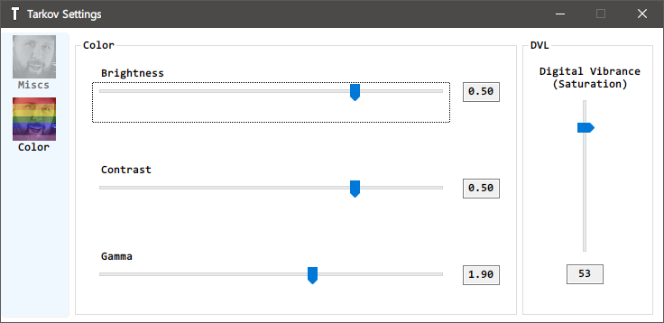

# tarkov-settings

## [->**DOWNLOAD Latest**<-](https://github.com/incheon-kim/tarkov-settings/releases/latest)

Automatically change color settings for [Escape from Tarkov](https://escapefromtarkov.com)

Change Digital Vibrance Control value from Nvidia Settings with [NvAPIWrapper](https://github.com/falahati/NvAPIWrapper) and Gamma value with some [Win32 API calls](https://docs.microsoft.com/en-us/windows/win32/api/wingdi/nf-wingdi-setdevicegammaramp)

It changes display color values when only Escape from Tarkov Window is focused so it could prevent from sudden flash from display.

--- 
Nvidia GPU **fully supported.** (Brightness/Contrast/Gamma/Saturation)

AMD GPU **partially supported.** (Except Saturation)

Intel/Etc is not supported yet.

---

## What does it do?
1. Change Brightness/Contrast/Gamma of display
2. Change Digital Vibrance Control (Saturation)
3. Change color settings only while EFT window is activated (It prevents **sudden flash during Alt-tabbing**)

## How to Use
1. Open application (SmartGuard might prevent open it because I didn't signed it)
2. Set color setting

*  *  * (If you double click Brightness/Contrast/Gamma/Digital Vibrance Text it will change to default value)

3. Minimize it and play EFT
4. Close application if you want to deactivate

## Warning
1. It might blink couple times when you active EFT window but it works. Don't worry
2. ## **I don't know BSG will ban for using this.**
3. AMD only supports Brightness/Contrast/Gamma Control
4. Intel Graphics is not supported
5. ## Only works in **Borderless mode.**
6. Nvidia Optimus Environment (mostly laptops) is not tested.

## TODO
- [x] Process Focusing Awareness
- [x] Digital Vibrance Value Change
- [x] Gamma Value Change
- [x] Brightness, Contrast, Gamma Value modify
- [x] GUI
- [x] ini or json configuration
- [x] Process Changeability (Not only for EscapeFromTarkov)
- [x] change display(monitor) target
- [ ] EFT setting modify (Framelimit or Graphic Settings)
